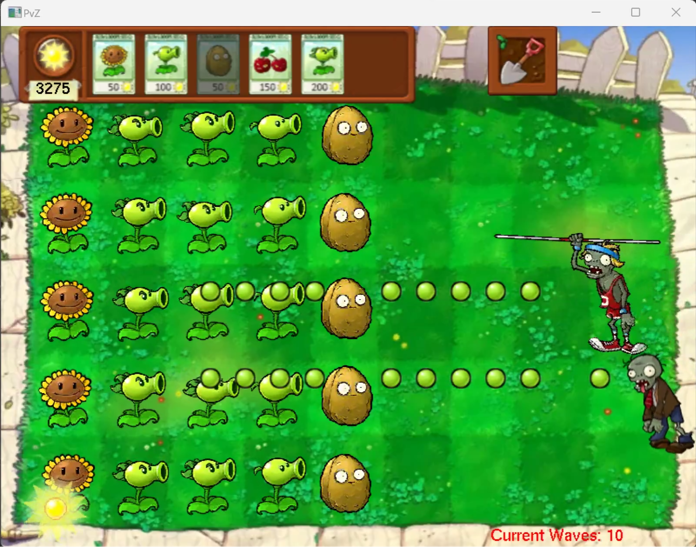
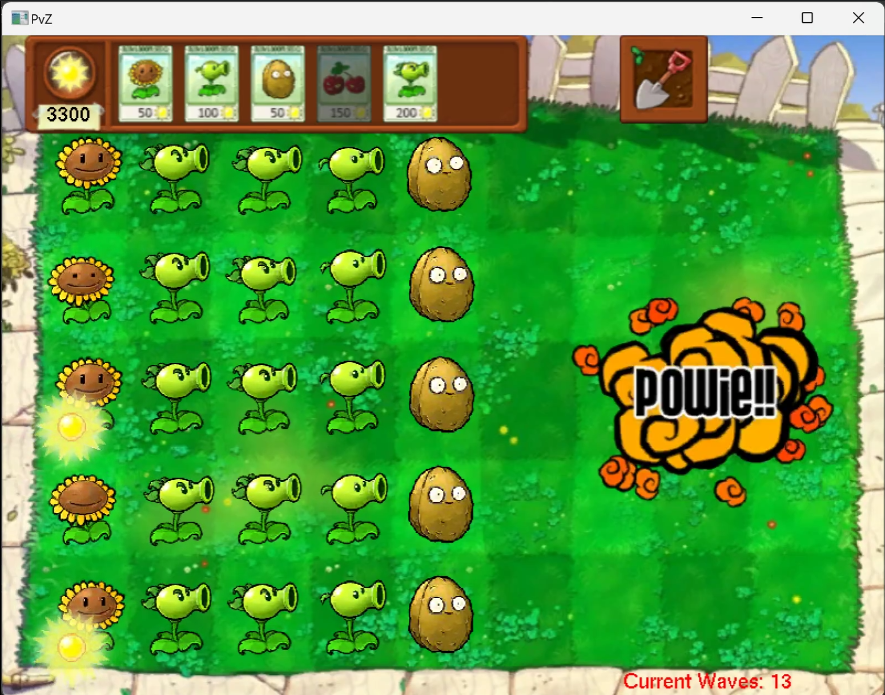

# Plants vs Zombies - C++ Implementation

A C++ remake of the classic tower defense game Plants vs Zombies, built with OpenGL and modern C++ design patterns.

## Project Overview

This is a simplified version of Plants vs Zombies featuring:
- **5 Plant Types**: Sunflower, Peashooter, Wallnut, Cherry Bomb, Repeater
- **3 Zombie Types**: Regular Zombie, Bucket Head Zombie, Pole Vaulting Zombie
- **Wave-based Gameplay**: Progressive difficulty with 30 waves
- **Grid-based Planting System**: 5 rows × 9 columns lawn
- **Real-time Combat**: Dynamic collision detection and projectile system

## Game Features

### Plants
- **Sunflower** : Generates sun resources (50 sun cost)
- **Peashooter** : Shoots peas at zombies (100 sun cost)
- **Wallnut** : High HP defensive plant (50 sun cost)
- **Cherry Bomb** : Area-of-effect explosive (150 sun cost)
- **Repeater** : Shoots two peas rapidly (200 sun cost)

### Zombies
- **Regular Zombie**: Basic slow-moving zombie
- **Bucket Head Zombie**: High HP armored zombie (appears after wave 8)
- **Pole Vaulting Zombie**: Fast zombie that jumps over plants (appears after wave 15)

### Game Mechanics
- Plant seeds on a 5×9 grid
- Collect falling sun to gain resources
- Remove plants with shovel tool
- Zombies spawn from the right side
- Game over if zombies reach the left boundary

## Architecture

### Core Components

```
src/
├── Framework/           # Core game engine
│   ├── GameManager.cpp    # Main game loop and rendering
│   ├── ObjectBase.cpp     # Base class for all game objects
│   └── SpriteManager.cpp  # Texture and sprite management
├── GameObject/          # Game entities
│   ├── Plant.cpp          # Plant base class
│   ├── Zombie.cpp         # Zombie base class
│   ├── PlantManager.cpp   # Plant lifecycle management
│   ├── ZombieManager.cpp  # Zombie spawning and management
│   ├── WaveManager.cpp    # Wave progression system
│   └── [Specific plants/zombies...]
└── GameWorld/          # Game world logic
    └── GameWorld.cpp      # Main game world controller
```

### Design Patterns

- **Singleton Pattern**: Managers (PlantManager, ZombieManager, etc.)
- **Factory Pattern**: PlantFactory, ZombieFactory for object creation
- **Manager Pattern**: Centralized entity lifecycle management
- **Deferred Update Pattern**: Batch additions/deletions to avoid iterator invalidation

## Build Instructions

### Prerequisites
- **CMake** 3.15 or higher
- **C++17** compatible compiler
- **OpenGL** libraries
- **FreeGLUT** (included in third_party/)
- **SOIL** (Simple OpenGL Image Library, included)

### Windows (Visual Studio)
```bash
mkdir build
cd build
cmake ..
cmake --build . --config Debug
```

### macOS/Linux
```bash
mkdir build
cd build
cmake ..
make
```

### Run the Game
```bash
# Windows
.\build\bin\Debug\PvZ.exe

# macOS/Linux
./build/bin/PvZ
```

## Controls

- **Mouse Left Click**: Plant seeds, collect sun, click zombies (debug)
- **Shovel**: Click shovel icon then click plants to remove
- **Enter**: Start game / Restart after game over
- **Esc**: Quit game

## Project Structure

```
attachment/
├── assets/              # Game sprites and textures
│   ├── *.png           # Plant, zombie, and UI sprites
│   └── *.jpg           # Background and game over images
├── include/pvz/        # Header files
│   ├── Framework/      # Core engine headers
│   ├── GameObject/     # Game object headers
│   └── GameWorld/      # Game world headers
├── src/                # Source files
│   ├── Framework/      # Engine implementation
│   ├── GameObject/     # Game objects implementation
│   ├── GameWorld/      # Game world implementation
│   └── main.cpp        # Entry point
├── third_party/        # External dependencies
│   ├── freeglut/       # OpenGL utility toolkit
│   └── SOIL/           # Image loading library
├── build/              # CMake build output (generated)
├── CMakeLists.txt      # Main CMake configuration
└── README.md           # This file
```

## Technical Details

### Code Conventions
- **Naming**:
  - Member variables: `m_variableName`
  - Static variables: `s_variableName`
  - Local variables: `camelCase`
  - Constants: `constexpr` or `const` with descriptive names
- **Comments**: English comments explaining logic and purpose
- **Memory Management**: Smart pointers (`shared_ptr`) for game objects

### Key Systems

#### Plant Management
- Seed packet UI with cooldown system
- Grid-based planting validation
- Deferred plant addition/removal
- Factory pattern for plant creation

#### Zombie Management
- Row-based zombie storage for efficient collision detection
- Progressive spawning difficulty
- Weighted random zombie type selection
- Basic AI: walk forward, eat plants when colliding

#### Wave System
- 30 waves with increasing difficulty
- Zombie count scales with wave number
- Advanced zombies appear in later waves
- Adaptive wave intervals (gets faster)

## Performance Optimizations

- **Deferred Updates**: Batch entity additions/deletions
- **Row-based Collision**: Only check zombies in same row as plants
- **Object Pooling**: Reuse game objects where possible
- **Efficient Rendering**: Sprite batching and texture caching

## Known Issues / Future Improvements

- [ ] No sound effects or music
- [ ] Limited plant variety (only 5 types)
- [ ] No level progression or lawn mowers
- [ ] Simplified sun generation system
- [ ] Basic AI without pathfinding

## Contributing

This is an educational project. Feel free to:
- Report bugs via issues
- Suggest improvements
- Fork and create your own variations
- Add new plant/zombie types

## License

This project is for educational purposes. Plants vs Zombies is a trademark of Electronic Arts Inc.

## Acknowledgments

- Original game by PopCap Games
- FreeGLUT library for OpenGL utilities
- SOIL library for image loading
- Sprite assets extracted from original game for educational use

---

**Note**: This is a simplified remake for learning C++ game development concepts. It is not affiliated with or endorsed by Electronic Arts or PopCap Games.

## Learning Resources

If you're learning from this codebase:
1. Start with `GameManager.cpp` to understand the game loop
2. Study `PlantManager` and `ZombieManager` for entity management patterns
3. Look at specific plant implementations to see inheritance in action
4. Examine `WaveManager` for game progression logic
5. Check `Zombie::BasicUpdate()` for AI implementation




Happy coding!

